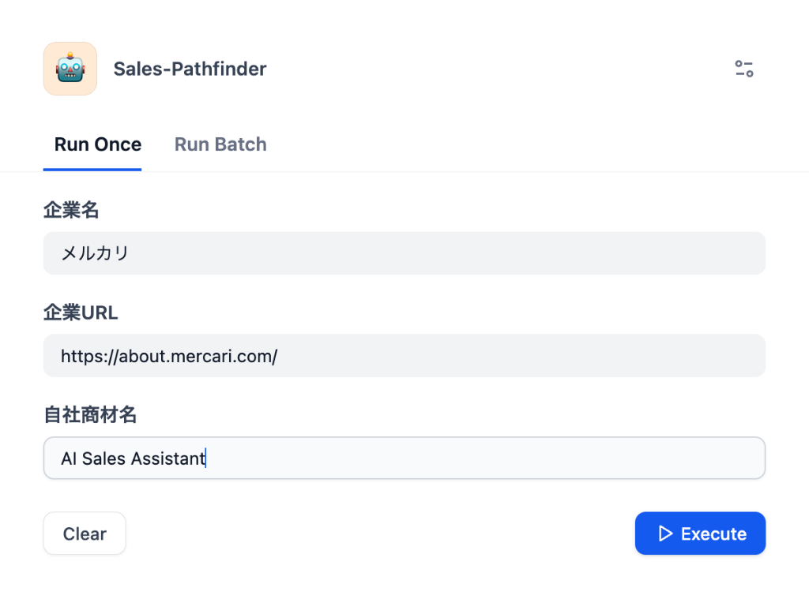
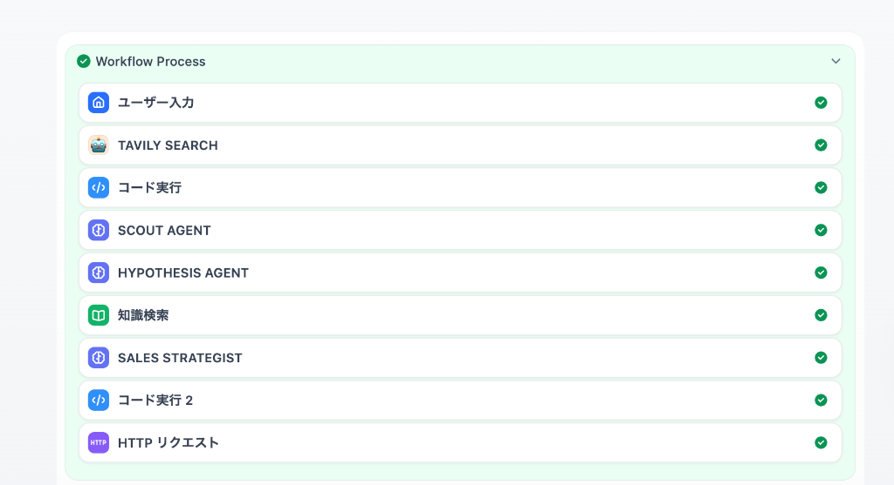

# Sales Pathfinder 🚀

**商談準備を「Dify Web App」で完結させるAIエージェント**

Sales Pathfinderは、指定された企業をリサーチし、商談で使える「仮説提案書」を自動生成するシステムです。
入力フォームに企業情報を入れるだけで、AIが分析を行い結果を表示します。

---

## 🏗 アーキテクチャ

Dify単体、またはDifyとGoogle Docsを連携させて動作します。
（本ポートフォリオでは、Dify Web App上での入出力のみでも機能します）

```mermaid
graph LR
    User((User)) -->|Input Form| Dify[Dify Web App]
    Dify -->|Search & Analysis| Dify
    Dify -->|Display Result| User
    Dify -->|Webhook (Optional)| Make
    Make -->|Create| GDocs[Google Docs]
```

---

## ⚡️ クイックスタート (Setup)

### 1. Dify (AIブレイン & UI)

Difyの **"Workflow App"** として構築します。

1.  Difyにて「空白から作成」→「ワークフロー」を選択。
2.  このリポジトリの `src/dify-workflows/` にあるDSLファイルをインポート（または参考にして構築）。
3.  **入力変数 (Input Variables)** を設定：
    *   `company_name` (Text input, Required)
    *   `company_url` (Text input, Required)
    *   `product_name` (Text input, Required)
4.  **処理フロー**:
    *   Google Search / Tavily Search ノードで情報収集。
    *   LLMノードで分析・ライティング。
    *   **終了 (End)** ノードで結果のテキストを出力。

### 2. (Optional) Make & Google Docs

結果をGoogle Docsとして保存したい場合の拡張設定です。

*   Difyワークフローの最後に「HTTP Request」ノードを追加し、MakeのWebhook URLにデータを送信します。
*   Make側で受け取ったデータを元に `Create a Document from Template` を実行します。

---

## 💻 使い方 (Usage)

1.  Difyの「公開する」>「アプリを実行」をクリックし、Webアプリ画面を開きます。
2.  フォームに以下の情報を入力して「実行」ボタンを押します。
    *   **Company Name**: `株式会社サイボウズ`
    *   **Company URL**: `https://cybozu.co.jp`
    *   **Product Name**: `AIチャットボット`
3.  画面右側に、AIによる分析レポート（商談準備シートの内容）が表示されます。

---

## 📄 レポート出力イメージ

以下のような分析結果が出力されます。

```markdown
# 商談準備シート: 株式会社サイボウズ

## 1. 企業概要
- **企業名**: 株式会社サイボウズ
- **URL**: https://cybozu.co.jp

## 2. 課題仮説 (Hypothesis)
（ここにAIが分析した、中期経営計画に基づいた課題仮説が表示されます）
- 海外拠点とのコラボレーション強化における...
- チームワークあふれる社会を作るための...

## 3. 提案シナリオ (Sales Scenario)
（ここに自社商材をどう提案するかのトークスクリプトが表示されます）
- フック: 「御社の米国市場での展開について...」
- 提案: 「弊社のAIチャットボットなら、時差を超えたサポートが可能です」
```

---

## 🎬 デモシナリオ (Portfolio Demo)

ポートフォリオとして展示する際は、以下のシナリオで実演すると効果的です。

### ケーススタディ: 「メルカリ」への自己提案（Meta Demo）

**設定:** 
あなたは「Sales Pathfinder（本ツール）」の営業担当です。
株式会社メルカリの営業・マーケティング組織に対して、このツール自体を売り込みます。

**入力データ:**
*   **Company Name**: `株式会社メルカリ`
*   **Company URL**: `https://about.mercari.com/`
*   **Product Name**: `AI Sales Assistant`


**見どころ (AIの推論ポイント):**

1.  **情報の発見**: メルカリが「グローバル採用」や「新規事業」に力を入れていることをWeb検索から見つけ出す。
2.  **課題の特定**: 「多様なバックグラウンドを持つ社員が増えるにつれ、英語/日本語の壁や、文化の共有が難しくなるのでは？」という仮説を立てる。
3.  **提案の接続**: 「多言語対応」という自社商材の強みを、その課題に対するベストソリューションとして提示する。

### 📸 実機デモ (Evidence)

#### 1. 入力画面 (Simple Interface)
企業名とURLを入れるだけで、複雑なプロンプトは不要。


#### 2. 思考プロセス (Chain of Thought)
AIが複数の情報ソースを巡回・分析し、仮説を組み立てている様子。


#### 3. 実行結果 (Final Output)
Slackに通知が届き、Google Docsのレポートが生成されます。


### 📊 生成されたレポート (Actual Result)

以下は、このツールが実際に生成した「メルカリ様向けの商談準備シート」の原文です。

```text
━━━━━━━━━━━━━━━━━━━━━━━━━━━━━━
対象企業: メルカリ
企業URL: https://about.mercari.com/
対象商材: AI Sales Assistant
━━━━━━━━━━━━━━━━━━━━━━━━━━━━━━

【1. 企業サマリー】
【事業概要】
・メルカリは日本を代表するC2Cフリマアプリであり、急成長を遂げている。収益は主に手数料によるものであり、日本国内での圧倒的なシェアを持つ。
【経営方針】
・中期経営計画では、国内外での市場拡大とサービスの多様化を掲げている。
【最近の動き】
・最近は海外進出に力を入れており、アジア地域での展開を強化している。直近の重要ニュースとして、新規事業の立ち上げが報じられている。

【2. 課題分析】
【経営視点の課題】
・課題の表層: 市場競争による成長阻害
・課題の本質: 成長戦略の遂行が競合他社の影響で妨げられる可能性
・放置した場合のリスク: 市場シェアの減少や新規事業展開の遅れ

【現場視点の課題】
・課題の表層: 人材不足とスキルギャップ
・課題の本質: 適切な人材確保とスキル向上が業務プロセスの質を左右する
・影響を受ける部門: テクノロジーチーム、採用チーム
・現場の声（想定）: 「新しいプロジェクトに取り組むためには専門知識が必要だが、適切な人材が不足している」

【3. 提案シナリオ】
【フック（30秒で興味を引く）】
・経営層向け: メルカリのグローバル市場でのリーダーシップを維持するために、競合対策と人材戦略の重要性
・現場担当者向け: テクノロジーチームの成長を支援し、適切な人材を効率的に確保する方法

【商材接続ポイント】
・市場競争課題 → 成長戦略への影響 → AI Sales Assistantの市場分析機能 → 市場シェアの把握と競合対策
・人材不足課題 → 生産性への影響 → Sales Pathfinderの人材マッチング機能 → 適切な人材の確保とスキル向上
```

---


## 📁 ディレクトリ構成

```text
.
├── src/
│   └── dify-workflows/  # DifyのDSL設定ファイル
├── config/              # Difyナレッジ用サンプルデータ
└── README.md            # このドキュメント
```
