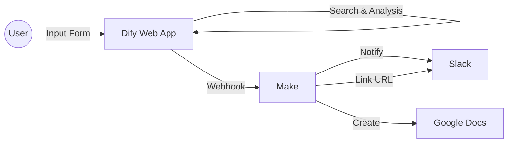
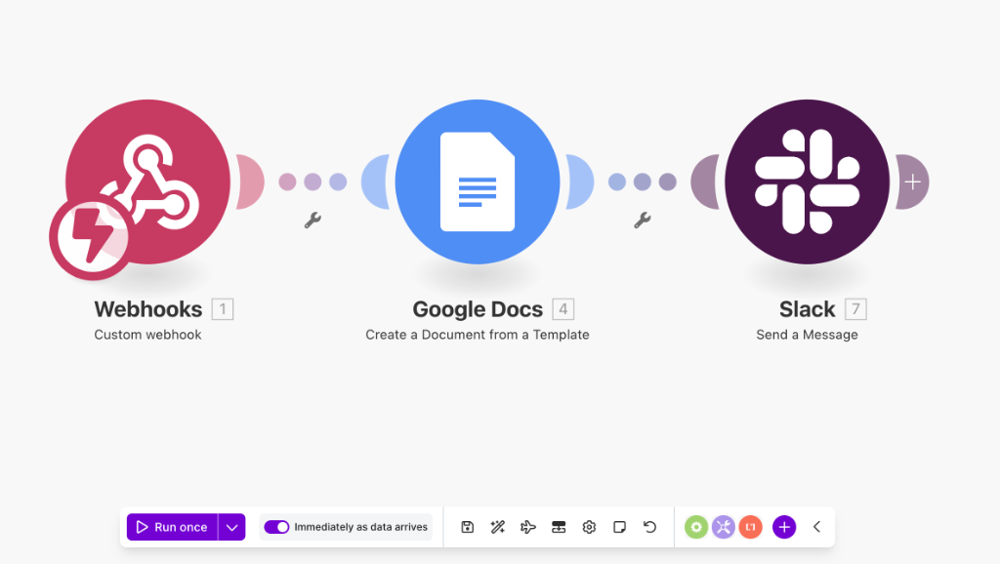
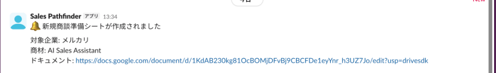

# Sales Pathfinder 🚀

**商談準備を「Dify Web App」で完結させるAIエージェント**

Sales Pathfinderは、指定された企業をリサーチし、商談で使える「仮説提案書」を自動生成するシステムです。
入力フォームに企業情報を入れるだけで、AIが分析を行い結果を表示します。

---

## 🏗 アーキテクチャ

Difyで推論・生成を行い、Make経由でSlack通知とGoogle Docs作成を行います。



---

## ⚡️ クイックスタート (Setup)

### 1. Dify (AIブレイン & UI)

Difyの **"Workflow App"** として構築します。

1.  Difyにて「空白から作成」→「ワークフロー」を選択。
2.  このリポジトリの `src/dify-workflows/` にあるDSLファイルをインポート。
3.  **入力変数 (Input Variables)** を設定：
    *   `company_name` (Text input, Required)
    *   `company_url` (Text input, Required)
    *   `product_name` (Text input, Required)
4.  **Webhook設定**:
    *   後述するMakeのWebhook URLを、Difyワークフロー末尾の「HTTP Request」ノードに設定します。

### 2. Make (Automation)

Difyの出力を受け取り、各種ツールへ連携します。

1.  Makeにて新規シナリオを作成し、**Custom Webhook** をトリガーに設定。
2.  以下のフローを構築します：
    *   **Webhook**: Difyからのデータ受信
    *   **Google Docs**: テンプレートからドキュメントを作成 (`Create a Document from Template`)
    *   **Slack**: 作成されたドキュメントのURLを通知 (`Send a Message`)

---

## 💻 使い方 (Usage)

1.  Difyの「公開する」>「アプリを実行」をクリックし、Webアプリ画面を開きます。
2.  フォームに以下の情報を入力して「実行」ボタンを押します。
    *   **Company Name**: `株式会社サイボウズ`
    *   **Company URL**: `https://cybozu.co.jp`
    *   **Product Name**: `AIチャットボット`
3.  画面右側に、AIによる分析レポート（商談準備シートの内容）が表示されます。

---

## 📄 レポート出力イメージ

以下のような分析結果が出力されます。

```markdown
# 商談準備シート: 株式会社サイボウズ

## 1. 企業概要
- **企業名**: 株式会社サイボウズ
- **URL**: https://cybozu.co.jp

## 2. 課題仮説 (Hypothesis)
（ここにAIが分析した、中期経営計画に基づいた課題仮説が表示されます）
- 海外拠点とのコラボレーション強化における...
- チームワークあふれる社会を作るための...

## 3. 提案シナリオ (Sales Scenario)
（ここに自社商材をどう提案するかのトークスクリプトが表示されます）
- フック: 「御社の米国市場での展開について...」
- 提案: 「弊社のAIチャットボットなら、時差を超えたサポートが可能です」
```

---

## 🎬 デモシナリオ (Portfolio Demo)

ポートフォリオとして展示する際は、以下のシナリオで実演すると効果的です。

### ケーススタディ: 「メルカリ」への自己提案（Meta Demo）

**設定:** 
あなたは「Sales Pathfinder（本ツール）」の営業担当です。
株式会社メルカリの営業・マーケティング組織に対して、このツール自体を売り込みます。

**入力データ:**
*   **Company Name**: `株式会社メルカリ`
*   **Company URL**: `https://about.mercari.com/`
*   **Product Name**: `AI Sales Assistant`


**見どころ (AIの推論ポイント):**

1.  **情報の発見**: メルカリが「グローバル採用」や「新規事業」に力を入れていることをWeb検索から見つけ出す。
2.  **課題の特定**: 「多様なバックグラウンドを持つ社員が増えるにつれ、英語/日本語の壁や、文化の共有が難しくなるのでは？」という仮説を立てる。
3.  **提案の接続**: 「多言語対応」という自社商材の強みを、その課題に対するベストソリューションとして提示する。

### 📸 実機デモ (Evidence)

#### 1. 入力画面 (Simple Interface)
企業名とURLを入れるだけで、複雑なプロンプトは不要。


#### 2. 思考プロセス (Chain of Thought)
AIが複数の情報ソースを巡回・分析し、仮説を組み立てている様子。


#### 3. 連携処理 (Automation)
Makeを通して、SlackだけでなくGoogle Docsへの出力も自動化されています。


#### 4. 実行結果 (Final Output)
Slackに通知が届き、Google Docsのレポートが生成されます。


### 📊 生成されたレポート (Actual Result)

以下は、このツールが実際に生成した「メルカリ様向けの商談準備シート」の原文です。
（※一部抜粋ではなく、全文を掲載しています）

```text
━━━━━━━━━━━━━━━━━━━━━━━━━━━━━━
対象企業: メルカリ
企業URL: https://about.mercari.com/
対象商材: AI Sales Assistant
━━━━━━━━━━━━━━━━━━━━━━━━━━━━━━

【1. 企業サマリー】
【事業概要】
・メルカリは日本を代表するC2Cフリマアプリであり、急成長を遂げている。収益は主に手数料によるものであり、日本国内での圧倒的なシェアを持つ。

【業績動向】
・直近の売上・利益トレンドは右肩上がりであり、成長率は二桁に及んでいる。

【経営方針】
・中期経営計画では、国内外での市場拡大とサービスの多様化を掲げている。

【組織体制】
・従業員数は増加傾向にあり、フラットな組織文化を持つ。

【最近の動き】
・最近は海外進出に力を入れており、アジア地域での展開を強化している。直近の重要ニュースとして、新規事業の立ち上げが報じられている。

【2. 課題分析】
【経営視点の課題】
・課題の表層: 市場競争による成長阻害
・課題の本質: 成長戦略の遂行が競合他社の影響で妨げられる可能性
・背景・文脈: 成長を続けるメルカリにおいて、市場シェアの獲得や維持が至上命令である
・根拠ソース: メルカリの成長と競合他社の動向に関する市場調査レポート
・深刻度: 中（競争激化のリスクは高いが、対策次第で克服可能）
・放置した場合のリスク: 市場シェアの減少や新規事業展開の遅れ
・解決時のインパクト: 新規市場への進出や既存市場でのポジション強化

【現場視点の課題】
・課題の表層: 人材不足とスキルギャップ
・課題の本質: 適切な人材確保とスキル向上が業務プロセスの質を左右する
・影響を受ける部門: テクノロジーチーム、採用チーム
・根拠ソース: メルカリの人事部門報告書とエンジニアからのフィードバック
・深刻度: 高（人材不足がビジネスの成長に直結）
・現場の声（想定）: 「新しいプロジェクトに取り組むためには専門知識が必要だが、適切な人材が不足している」
・解決時のインパクト: 生産性向上とイノベーションの促進

【3. 提案シナリオ】
【フック（30秒で興味を引く）】
・経営層向け: メルカリのグローバル市場でのリーダーシップを維持するために、競合対策と人材戦略の重要性
・現場担当者向け: テクノロジーチームの成長を支援し、適切な人材を効率的に確保する方法

【仮説検証の質問（SPIN法）】
・状況質問: 競合他社との差別化を図るための取り組みはありますか？
・問題質問: 適切な人材確保のための具体的な施策はどのように検討されていますか？
・示唆質問: 新規市場への進出に伴う人材ニーズはどのように変化していますか？
・解決質問: スキルギャップの解消に向けて、内部研修や外部人材の活用は検討されていますか？

【商材接続ポイント】
・市場競争課題 → 成長戦略への影響 → AI Sales Assistantの市場分析機能 → 市場シェアの把握と競合対策
・人材不足課題 → 生産性への影響 → Sales Pathfinderの人材マッチング機能 → 適切な人材の確保とスキル向上

【想定される反論と切り返し】
・「今は忙しい」→ 背景: 新規市場進出に伴う緊急性を説明 → 切り返し: AI Sales Assistantが業務負荷を軽減
・「既存ツールがある」→ 背景: 既存ツールの不十分さを指摘 → 切り返し: Sales PathfinderのAI機能が他ツールを上回る
・「費用対効果が不明」→ 背景: ROI算出方法を説明 → 切り返し: 他社導入事例に基づく具体的な数値提案
・「社内稟議が通らない」→ 背景: 稟議通過の重要性を説明 → 切り返し: 導入事例や成功事例を提示

【4. ネクストアクション】
・推奨アプローチ: デモと導入効果の実証、事例紹介を含むワークショップ
・キーパーソン: CTO、人事部長、グローバルビジネス開発担当
・最適なタイミング: 今後の戦略会議や人材戦略策定時
・準備すべき資料: AI Sales AssistantとSales Pathfinderの機能比較資料、導入事例資料
・次回商談で確認すべきこと: AI Sales Assistantの導入効果の具体的な数値、Sales Pathfinderの導入計画とスケジュール
```

---


---

## 🔧 開発者向け (For Developers)

環境構築、ローカル開発、デプロイ手順などの詳細な技術情報は、以下のドキュメントを参照してください。

- [📖 開発ガイド (Development Guide)](docs/DEVELOPMENT_GUIDE.md)

---

## 📁 ディレクトリ構成

```text
.
├── src/
│   └── dify-workflows/  # DifyのDSL設定ファイル
├── config/              # Difyナレッジ用サンプルデータ
└── README.md            # このドキュメント
```
